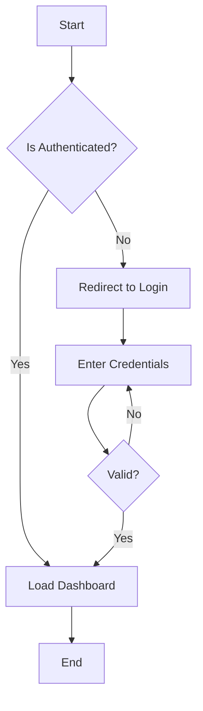

# Diagrams

## 📋 Overview

This section contains visual documentation including Entity Relationship Diagrams (ERD), process flow diagrams, system architecture diagrams, and other visual aids that help understand the DICT Project.

## 📁 Directory Structure

```
diagram/
├── README.md              # This file
├── erd/                   # Entity Relationship Diagrams
│   └── README.md
└── process-flow/          # Process Flow Diagrams
    └── README.md
```

## 🎨 Diagram Types

### 1. Entity Relationship Diagrams (ERD)

**Location**: `docs/diagram/erd/`

ERDs show database structure, tables, relationships, and constraints.

**Contents:**
- Complete system ERD
- Module-specific ERDs
- Table relationship diagrams

**Tools:**
- [dbdiagram.io](https://dbdiagram.io/) - Recommended
- [draw.io](https://draw.io/)
- [Lucidchart](https://www.lucidchart.com/)
- [MySQL Workbench](https://www.mysql.com/products/workbench/)

### 2. Process Flow Diagrams

**Location**: `docs/diagram/process-flow/`

Flowcharts showing business processes, user journeys, and system workflows.

**Contents:**
- User authentication flow
- Leave application process
- Attendance workflow
- Approval workflows
- Data synchronization flows

**Tools:**
- [draw.io](https://draw.io/) - Recommended
- [Lucidchart](https://www.lucidchart.com/)
- [Mermaid](https://mermaid.js.org/) - Text-based diagrams
- [Figma](https://www.figma.com/)

## 📝 Diagram Standards

### File Naming Convention

```
[module]-[type]-[description].png
```

Examples:
- `auth-flow-login-process.png`
- `leave-flow-approval-workflow.png`
- `system-erd-complete.png`
- `attendance-flow-time-in-out.png`

### File Formats

**Source Files** (editable):
- `.drawio` for draw.io diagrams
- `.dbml` for dbdiagram.io files
- `.lucid` for Lucidchart files

**Export Files** (for documentation):
- `.png` - Primary format for embedding
- `.svg` - Vector format (alternative)
- `.pdf` - For printing

### Diagram Elements

**Colors:**
- **Blue (#3B82F6)**: Primary entities/actions
- **Green (#10B981)**: Success/completion states
- **Red (#EF4444)**: Errors/failures
- **Yellow (#F59E0B)**: Warnings/pending states
- **Gray (#6B7280)**: Inactive/disabled states

**Typography:**
- **Font**: Arial or similar sans-serif
- **Entity Names**: Bold, 14pt
- **Attributes**: Regular, 11pt
- **Labels**: Regular, 10pt

## 🔄 Creating Diagrams

### ERD with dbdiagram.io

1. Visit [dbdiagram.io](https://dbdiagram.io/)
2. Define tables using DBML syntax:

```dbml
Table users {
  id int [pk, increment]
  name varchar(255)
  email varchar(255) [unique]
  password varchar(255)
  role_id int [ref: > roles.id]
  office_id int [ref: > offices.id]
  created_at timestamp
  updated_at timestamp
}

Table roles {
  id int [pk, increment]
  name varchar(50)
  description text
}

Table offices {
  id int [pk, increment]
  name varchar(255)
  code varchar(10)
}
```

3. Export as PNG or PDF
4. Save DBML source in `erd/` folder

### Flowchart with draw.io

1. Visit [draw.io](https://draw.io/)
2. Choose template or start blank
3. Use standard flowchart symbols:
   - **Oval**: Start/End
   - **Rectangle**: Process/Action
   - **Diamond**: Decision
   - **Parallelogram**: Input/Output
   - **Arrow**: Flow direction

4. Export as PNG (300 DPI recommended)
5. Save .drawio source file

### Mermaid Diagrams (Text-based)



Save as `.mmd` file and render to PNG using:
- [Mermaid Live Editor](https://mermaid.live/)
- VS Code Mermaid extension
- Command line: `mmdc -i diagram.mmd -o diagram.png`

## 📊 Example Diagrams

### System Architecture Diagram

Shows high-level system components and their interactions:

```
┌─────────────┐     ┌──────────────┐     ┌──────────┐
│   Browser   │────▶│ Nginx Server │────▶│ Laravel  │
│  (React)    │◀────│   (Proxy)    │◀────│  (API)   │
└─────────────┘     └──────────────┘     └─────┬────┘
                                                │
                                          ┌─────▼────┐
                                          │ Database │
                                          └──────────┘
```

### Authentication Flow

```
User → Login Page → Enter Credentials → Validate
                                          │
                                    ┌─────▼─────┐
                                    │  Valid?   │
                                    └─┬───────┬─┘
                                   Yes│      │No
                                      │      │
                               ┌──────▼──┐   │
                               │ Create  │   │
                               │ Session │   │
                               └──────┬──┘   │
                                      │      │
                                Dashboard ◄──┘
                                          Show Error
```

### Database ERD (Simplified)

```
┌─────────────┐       ┌──────────────┐
│    users    │       │   offices    │
├─────────────┤       ├──────────────┤
│ id (PK)     │       │ id (PK)      │
│ name        │       │ name         │
│ email       │       │ code         │
│ office_id ──┼──────▶│              │
└─────────────┘       └──────────────┘
       │
       │ 1:N
       │
┌──────▼──────┐
│ attendances │
├─────────────┤
│ id (PK)     │
│ user_id (FK)│
│ date        │
│ time_in     │
│ time_out    │
└─────────────┘
```

## 📥 Embedding Diagrams

### In Markdown

```markdown

```

### With Caption

```markdown
**Figure 1: System Architecture**


*The diagram shows the high-level architecture of the DICT Project.*
```

### Relative Paths

From main README:
```markdown

```

From module docs:
```markdown

```

## 🔄 Updating Diagrams

### When to Update

- Database schema changes
- New features added
- Process flow modifications
- Architecture changes
- Bug fixes affecting flows

### Update Process

1. Open source file (`.drawio`, `.dbml`, etc.)
2. Make necessary changes
3. Export to PNG/SVG
4. Replace old diagram file
5. Update documentation referencing the diagram
6. Commit both source and exported files

## ✅ Diagram Checklist

Before finalizing a diagram:

- [ ] Clear and readable at 100% zoom
- [ ] All text is legible
- [ ] Colors follow standard conventions
- [ ] Legend included (if needed)
- [ ] Title/caption added
- [ ] Source file saved
- [ ] Exported in correct format
- [ ] File named correctly
- [ ] Embedded in relevant documentation

## 🛠️ Recommended Tools

### Free Tools

1. **draw.io** (Diagrams.net)
   - Free and open-source
   - Works in browser or desktop
   - Large shape library
   - [https://draw.io](https://draw.io)

2. **dbdiagram.io**
   - Free for public diagrams
   - Text-based (DBML)
   - Auto-layout
   - [https://dbdiagram.io](https://dbdiagram.io)

3. **Mermaid**
   - Text-based diagrams
   - Version control friendly
   - GitHub rendering support
   - [https://mermaid.js.org](https://mermaid.js.org)

### Paid Tools

1. **Lucidchart**
   - Professional diagrams
   - Collaboration features
   - Templates
   - [https://www.lucidchart.com](https://www.lucidchart.com)

2. **Microsoft Visio**
   - Industry standard
   - Extensive templates
   - Office integration

## 📚 Resources

- [Database Design Tutorial](https://www.lucidchart.com/pages/database-diagram/database-design)
- [Flowchart Symbols Guide](https://www.smartdraw.com/flowchart/flowchart-symbols.htm)
- [UML Diagrams](https://www.uml-diagrams.org/)
- [System Architecture Patterns](https://docs.microsoft.com/en-us/azure/architecture/guide/)

## 📞 Need Help?

- Review existing diagrams for examples
- Check tool documentation
- Ask the development team
- Refer to [Documentation Guide](../DOCUMENTATION_GUIDE.md)

---

*A picture is worth a thousand words. Good diagrams make complex systems understandable.*

